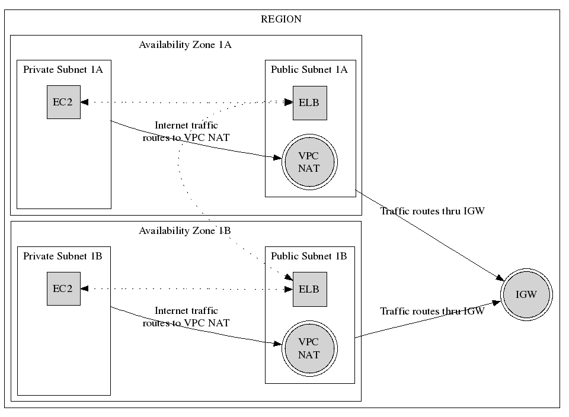

### VPC MODULE

This is based on segment.io's VPC with some slight tweaks
https://github.com/segmentio/stack

This module requires 7 variables to be passed in as defined in
[variables.tf](./variables.tf)

type | var
--- | ---
string | region
string | name
string | env
string | cidr_block
list | availability_zones
map | private_subnets
map | public_subnets

In Terraform, dictionaries are defined as maps.  The number of keys in
`private_subnets` and `public_subnets` should match the length of
`availability_zones`.  These variables are heavily tied together and
will be called throughout.

#### Example:
```hcl
provider "aws" {
    region  = "${var.region}"
}

module "vpc" {
    # You will need an SSH key setup to authenticate to Github
    source  = "git::ssh://git@github.com/KeplerGroup/kepler-terraform-modules//aws//vpc"

    name                = "${var.name}"
    env                 = "${var.env}"
    cidr_block          = "${var.cidr_block}"
    availability_zones  = ["${var.availability_zones}"]
    private_subnets     = "${var.private_subnets}"
    public_subnets      = "${var.public_subnets}"
}

```

#### Diagram
This diagram shows an example of a VPC with two availability zones with a
private and public subnet in each zone.  Please note the EC2 and ELB resources
are there as place olders and only used to diagram a sample setup.

In the diagram below, we setup a VPC with 2 availability zones that contain a
private and public subnet, a VPC NAT Gateway.  The entire region creates a single
IGW that routes all internet traffic from the public subnets to the IGW.  Private
subnet traffic is routed through the VPC NAT Gateway.


